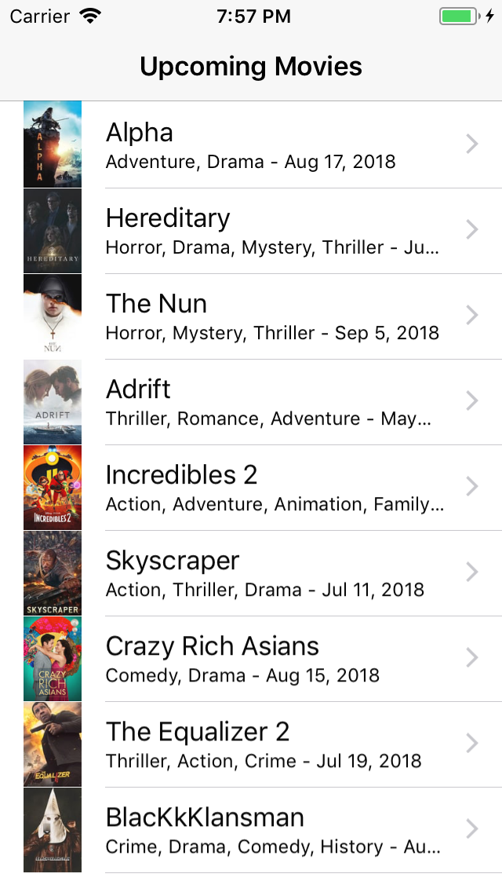
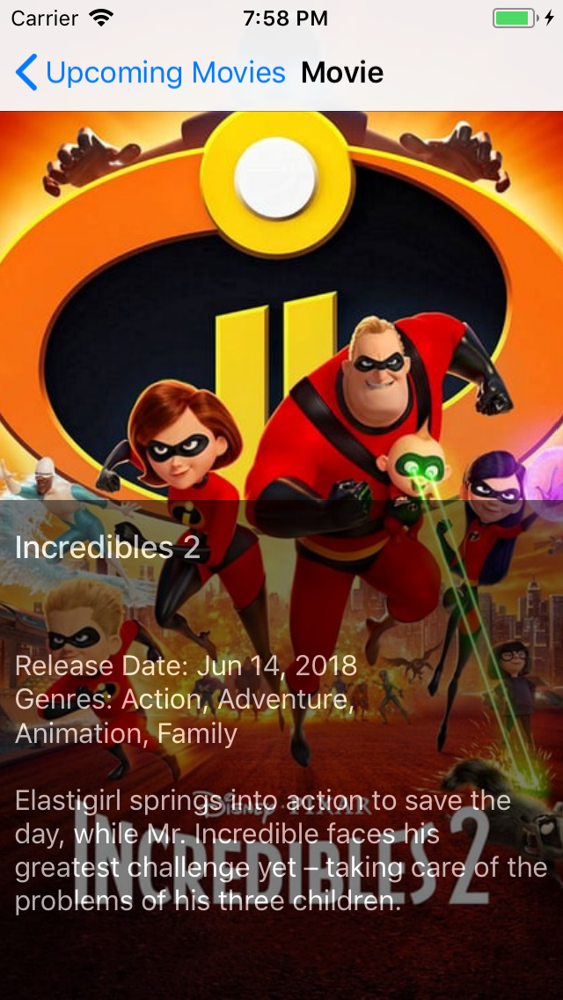
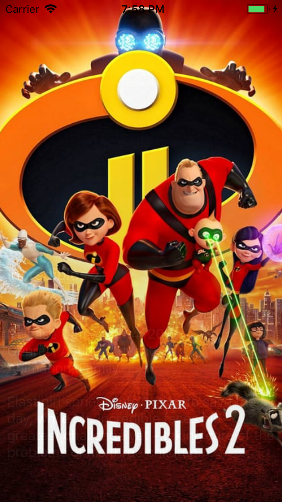
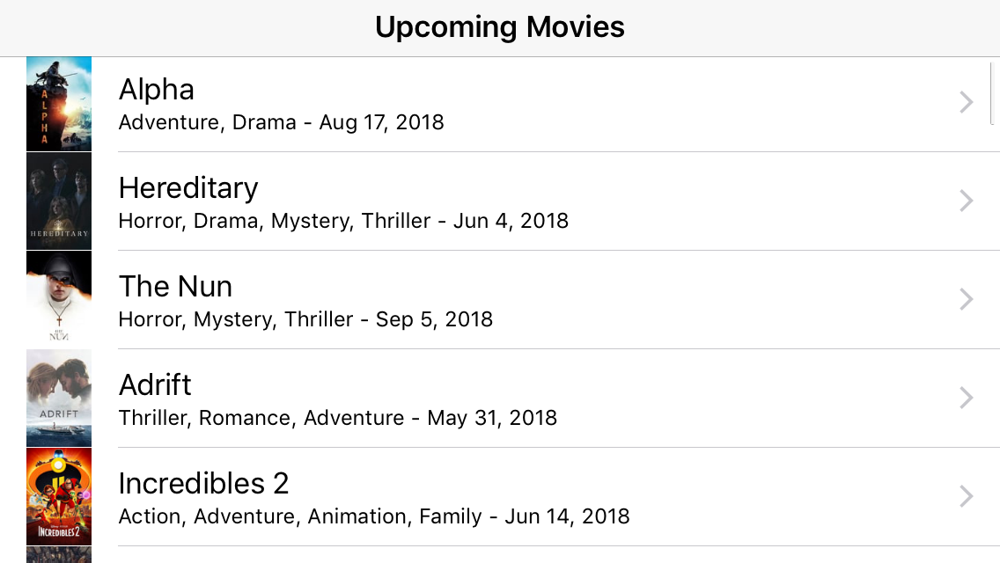
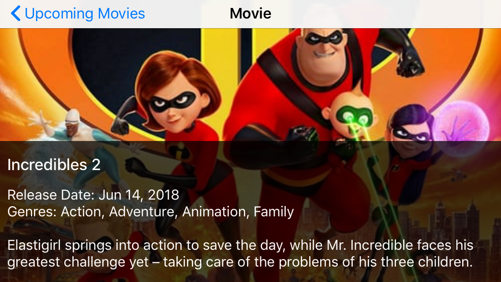

Upcoming Movies
===============

This app list upcoming movies and provide details after selecting one.

Screenshots
-----------

### Portrait

  

### Landscape

  

How to run
----------

### Pre requisites

* Xcode 9.4

### Build

Open Xcode workspace file `Upcoming Movies.xcworkspace` and `cmd + b`.

ps: This project use Cocoapods but all pods are commited, so you don't need to do a `pod install`

### Run

`cmd + r`

Test
----

This project have unit and ui testing.  
To run all tests press `cmd + u`.

Third-party libraries
---------------------

### APP

* [Alamofire](https://github.com/Alamofire/Alamofire) - Networking library to make requests. Is used to access The Movie Database API more easily.
* [AlamofireObjectMapper](https://github.com/tristanhimmelman/AlamofireObjectMapper) - Map JSON to Swift classes. Is used to convert response JSON to Movie class.
* [AlamofireImage](https://github.com/Alamofire/AlamofireImage) - Download and display images. Is used to download and display movie posters easily.

### Tests

* [Nimble](https://github.com/Quick/Nimble) - Nimble provides better tests readability using more expressive asserts.
* [OHHTTPStubs](https://github.com/AliSoftware/OHHTTPStubs) - OHHTTPStubs stubs request so we don't depend on the internet to run unit tests.
* [Swifter](https://github.com/httpswift/swifter) - Tiny http server engine written in Swift. It is used to provide fake JSON responses, so we can test UI without depending on the internet.

Nexts steps / Improvements
--------------------------

* Improve user experience on slow networks by adding a loading indicator when it's loading more movies.
* On MovieDetailViewController, set viewInfo's size accordingly to lblInfos text size. 
* Load genres list dynamically from API.  
* Add Localization strings to support more languages.  
